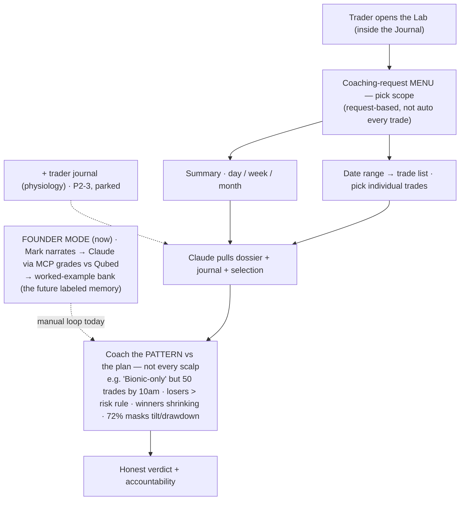

*TAGS: build, coaching, business-plan | AUDIENCE: founder + every future Claude (the COACHING engine — the "weigh-in" half of the thesis).*
*CREATED: 2026-06-07, Chat 6 | UPDATED: 2026-06-08, Chat 6 (added QUBED GRADING — Q³ + good/bad-trade inversion + two flags: journal needs structured EV schema; voice = grade/flag NOT block/route to avoid regulated territory) | STATUS: captured (storyboard final; OPEN items noted; product deferred — FOUNDER MODE runs now, Chat 8)*
*SUPERSEDES: — | RELATED: coaching_philosophy.md (honest verdict, value≠profit), master_journey_flow.md (the journey), credit_value_pricing_model.md (per-session cost), tech_architecture_skeleton.md (how it runs), reports/bioniq_trade_review_template.docx (the printable)*

# GOLD — THE BIONIC LAB (the coaching engine)

## ONE-LINE
The Lab is where a trader **requests** honest, pattern-level coaching against their own stated plan. In
the Weight-Watchers thesis it's the **weigh-in** — the journal is the food diary (daily logging), the Lab
is the accountability session. This is the moat, not the journal.

## FOUNDER MODE (Chat 7/8 — how the Lab's loop runs TODAY, before any platform)
The Lab-as-product is **deferred** (bioniQ-first). Its coaching loop runs **manually now**: Mark narrates
a trade's 3 layers → **Claude (via MCP on the live chart — working, confirmed Chat 8; reads the GEX
indicator's plotted lines VISUALLY, not by data) grades it vs Qubed** per trade_coaching_method.md → banked
as a worked example (the coach's future labeled memory). Boundary applies here too: grades the **rule-based
Cubed system only — scalp is never taught** (teachable_vs_unteachable_boundary.md). The two-part journal
(trader physiology — trader_as_athlete_physiology_layer.md) extends the Lab's INPUTS later (Phase 2-3, parked).

## THE MODEL
- **Request-based, not auto-every-trade.** The trader opens the Lab and picks scope from a MENU — coaching
  is pulled when wanted, not pushed on every fill.
- **Two scopes:** a **Summary** (day / week / month) OR a **date range → trade list** where the trader
  selects individual trades.
- Claude then **pulls the dossier + journal + the selection** and coaches the **PATTERN vs the plan** —
  not each scalp. It ends in an **honest verdict + an accountability action.**

## WHY PATTERN-LEVEL (the scalper insight)
Coaching every individual scalp is **pointless, costly, and slow**. The same request-based, pattern-level
model serves a 3-trade system trader AND a 50-trade scalper. The point is the **deviation from the plan**,
e.g.: *"You said Bioniq setups only, but took 50 trades by 10am. PnL is green, but only because of a 72%
day — your losers exceeded your risk rule and your winners are shrinking. Strip the win rate and you're in
drawdown and tilting."* **Vanity win-rate ≠ edge.** (Independently validated: gamified "P&L-card" journals
create a feedback loop where traders optimize for trades that *look* good — high-win-rate scalps — over
trades that *pay* — higher-R trend trades. The Lab coaches against that, never celebrates it.)

## COST FIT
One summary read beats fifty trade reviews — that's what keeps the per-session cost in single-digit cents
(cache the dossier/strat/rubric; route cheap parsing to Haiku; reserve Sonnet/Opus for the coaching
judgment — see credit_value_pricing_model.md). Same scaling logic as the Bionic Briefing.

## PRINTABLE / EXPORTABLE REVIEW (feature)
Students like "Suzy" who get a strong review want a copy. Give them a **clean, branded
printable/exportable review** (PDF/doc) so they don't screen-cap a hacked-together version — we control how
it looks and keep the **"Powered by Bioniq · Be Bioniq"** framing on it. We keep every review on file; this
is their copy. Sample template: `reports/bioniq_trade_review_template.docx`.

## QUBED GRADING (how the Lab judges — from the Q³ blueprint)
The Lab grades each trade against **Qubed (Q³)** — Question · Qualify · Quantify (see bioniq_q_logic.md +
reports/bioniq_execution_matrix.pdf). Core principle = the **good-trade / bad-trade inversion**: a
disciplined loss that followed the rules is a structural WIN; a lucky win that broke the rules is a HAZARD.
Coach the process, not the outcome (the Suzy "$300 C-grade gamble" debrief is the model). Reads like a
flight-simulator debrief, not subjective praise.
**Two build/voice flags (so marketing copy doesn't write us into a corner):**
- **DATA SCHEMA REQUIREMENT:** computing per-setup Expected Value / Profit Factor (what the blueprint
  promises) requires the journal to capture **structured** trade data (entry, stop, target, setup-tag,
  outcome) from day one — you cannot compute per-variant EV from freeform notes. Design the journal schema
  around Q³ up front.
- **VOICE = GRADE/FLAG, NOT BLOCK/ROUTE:** the blueprint's draft copy says things like "the trade is
  blocked" and "routes to the CME clearinghouse." Keep the public voice to **grade / flag / coach** —
  bioniq is a coaching+journal brand (our moat), NOT an order-execution or blocking system. A tool that
  *blocks/routes orders* or *guarantees* capital outcomes drifts toward regulated broker/advisor territory.
  Coach that *grades* execution = safe and on-thesis.

## OPEN ITEMS
- **The stated plan** the Lab measures against: working assumption is it lives in the **intake/dossier**
  (set up front), so coaching always has a plan to compare to. Confirm where/when the trader sets it.
- **Coach's view (phase 3-4):** in the coaching-coaches end game, a coach's Lab view likely differs from a
  trader's (their students' patterns, not their own trades). Flagged, not yet designed.

## THE MAP (storyboard)

## INDEX LINE
`knowledge/bionic_lab_spec.md | build, coaching, business-plan | PUBLIC | captured | THE BIONIC LAB = the coaching engine (the "weigh-in" half of the thesis; the moat, not the journal). Request-based (menu), not auto-every-trade: trader picks Summary (day/week/month) OR date-range→pick individual trades; Claude pulls dossier+journal+selection and coaches the PATTERN vs the stated plan, not each scalp → honest verdict + accountability. Scalper insight: per-scalp coaching is pointless/costly/slow; serves 3-trade and 50-trade traders alike; vanity win-rate ≠ edge (a 72% green day can hide risk-rule breaks + shrinking winners + tilt). Cost fit: one summary read not 50 reviews → single-digit cents/session. PRINTABLE EXPORT feature: branded review copy (Powered by Bioniq) so students don't screen-cap; template in reports/. OPEN: where the plan is set (lean: intake/dossier); coach's Lab view (phase 3-4). FOUNDER MODE (Chat 8): Lab-as-product deferred; loop runs manually now — Mark narrates, Claude-via-MCP (reads GEX lines visually) grades vs Qubed → worked examples; grades rule-based Cubed only, never scalp; physiology journal extends inputs P2-3.`
