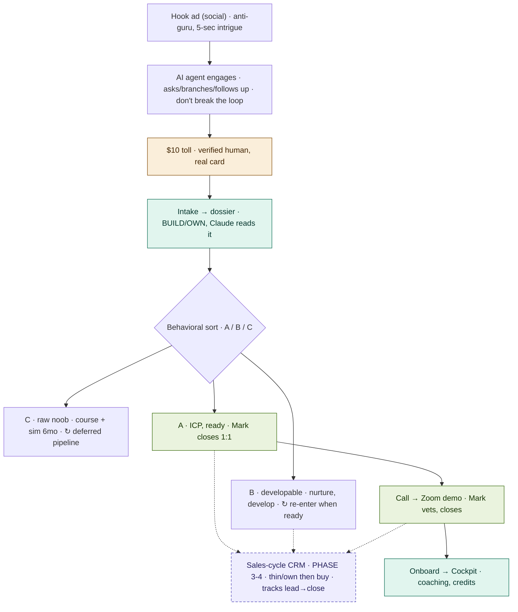

*TAGS: business-plan, marketing, coaching | AUDIENCE: founder + every future Claude (the door + the sort + the close).*
*CREATED: 2026-06-06, Chat 4 (parallel session) | UPDATED: 2026-06-07, Chat 6 (added THE FREE-JOURNAL HOOK — almost-free journal as top-of-funnel, coach is the paid upgrade. Earlier Chat 6: THE FUNNEL FLOW living-map Mermaid + CRM as phase-3-4 node). Chat 5: reconstructed from Chat-4's summary; $10-toll why folded in | STATUS: captured*
*SUPERSEDES: — | RELATED: master_journey_flow.md (the "Behavioral sort" + "Sales cycle" boxes), master_strategy_vision.md (the funnel section), funnel_brainstorm_reasoning.md, brand_funnel_architecture.md*
*PROVENANCE NOTE: reconstructed by Chat 5 from Chat 4's pasted summary of the doc it built. The substance is faithful; if Chat 4's original file has more precise response wording, reconcile against it — this is the merged home for the logic.*

# GOLD — FUNNEL ROUTING & THE CLOSER (the three buckets + who closes)

## WHAT THIS IS
The decision tree at the door: how a verified human gets sorted into one of three buckets, and what
happens to each. This is the detail behind the "Foyer door → Behavioral sort → Sales cycle / Nurture"
boxes on `master_journey_flow.md`.

## THE DOOR — the $10 toll is a FILTER, not revenue
The almost-free course ($200 → $10) exists to collect a tiny toll on a **real credit card**. The point
isn't the $10 — it's that paying it makes someone a **verified human with a real identity and a real
card (Amex/etc.).** Free attracts everyone, including trolls and tire-kickers; a small-but-nonzero price
repels the noise and proves minimal skin in the game. So the course is the vehicle, the $10 charge is
the velvet rope. Everyone past the toll is a known, verified lead — *then* they get sorted.
- Mark's own framing (kept honest): *"I don't think an almost-free course is a hook — but hell, if it
  brings dozens of clients, it worked."* Its real job is the filter + the verification, not the hype.

## THE THREE BUCKETS (the behavioral sort)
**1 — Raw noob (not ready).** Route to the **course as destination** + the honest line: *invest time,
not money — sim it for ~6 months, come back when you've logged real practice.* Costs us nothing, banks
goodwill, and seeds a **deferred pipeline**: today's noob is tomorrow's bucket-2 candidate. We don't
chase them; we leave the door open.

**2 — Half-knowledge / developable (near-ICP).** Guided education **while instilling solid practice** —
the "develop him" case. Knows enough to be dangerous, not enough to be consistent. Nurture with
structure until they're ready to be coached for real.

**3 — The ICP (hooked AND ready).** **Mark closes 1:1.** The key nuance: do **NOT** route a hot ICP
through the 90%-off course — that's a smack that cools the lead. Instead:
   - the personable human start — *"We'll be in touch"* — then **contact → call → Zoom → filter-on-call → close**;
   - and **in parallel**, the courtesy: *"in the meantime you're welcome to the basic course at 90% off"*
     — offered alongside, **never as a required detour.**

## THE TWO LOCKS (do not re-litigate)
- **Mark is the closer, NOW, by design.** 1:1 on Zoom — he has the time, no clients yet, and **learns
  onboarding by living it.** The fit-filter's final gate is Mark on the call. (The Whiting AI-sales-agent
  model is the *future* destination of Fork 1 — `master_journey_flow.md` — not today's build.)
- **The course must still be offered to the ICP** — because it was the **hook**. You can't bait with
  "almost-free course" then yank it the moment they qualify. Same asset, role depends on bucket: to the
  noob it's the destination, to the ICP it's a while-you-wait courtesy.

## WHY THE MODEL EXISTS (the Whiting-rejects-you insight)
The model clicked from watching how the best online sellers *filter FOR the clients they want* instead
of chasing the ones they don't — the prospect binges the material and self-qualifies; rejection is a
feature, not a failure. Our door + sort is that idea made concrete for traders.

## THE FUNNEL FLOW — the living map (Chat 6; Mermaid, edit as it evolves)
The door + 3-way sort + close, drawn. Teal = build/own (the moat). Green = the conversion path.
Amber = the $10 filter. Dashed = future/commodity. The **sales-cycle CRM is mapped here as a phase-3-4
node** so it isn't forgotten — *not* a now-build (the first leads track in a phone; see
build_vs_buy_and_competitive_read.md → CRM). The AI agent's "don't break the loop" rule: if a prospect
exits to external content, the agent follows up to pull them back.

## THE FREE-JOURNAL HOOK (Chat 6 — top-of-funnel idea)
A new entry point above the $10 toll: an **almost-free Journal (just the journal, no coach)** as
top-of-funnel. It gets verified humans logging daily (the food-diary habit), and the **coach is the paid
upgrade** (the Bionic Lab — bionic_lab_spec.md). Sits alongside the existing toll/almost-free-course logic:
cheap entry in, coaching is the conversion. (Naming: company = Bioniq Trader, the daily home = "Journal",
coaching = "Lab" — see brand_funnel_architecture.md.)

## INDEX LINE
`knowledge/funnel_routing_and_closer.md | business-plan, marketing, coaching | PUBLIC | captured | The door + the 3-bucket sort + the closer. $10 = verification toll (verified human on a real card), not revenue. Buckets: noob→course-as-destination/sim-6-months (deferred pipeline); half-knowledge→develop; ICP(ready)→Mark closes 1:1 (contact→call→Zoom→close), course offered IN PARALLEL at 90% off, never as a detour. Locks: Mark is the human closer NOW by design; the course must still be offered to the ICP (it was the hook). Reconstructed Chat-5 from Chat-4's summary.`
