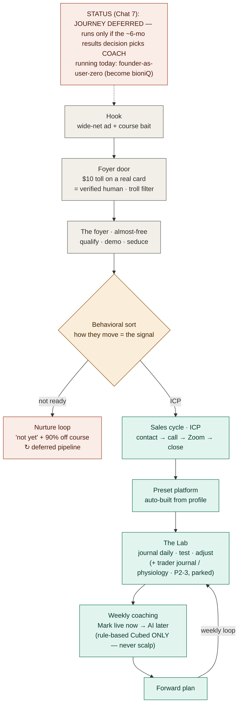

# GOLD — MASTER JOURNEY FLOW (the coordinate system)
*TAGS: business-plan, build, coaching | AUDIENCE: founder + every future Claude (orient here first).*
*CREATED: 2026-06-06, Chat 4 | UPDATED: 2026-07-11, Chat 8 (`CHANGED FROM PRIOR`: journey marked DEFERRED-not-abandoned per strategy_become_bioniq_first.md — only the founder-as-user-zero journey runs now; PRODUCT BOUNDARY added to the locks — teaches rule-based Cubed level-to-level ONLY, never scalp; regime-awareness = the teachable meta-skill; map banner added) | STATUS: captured (journey deferred)*
*SUPERSEDES: — | RELATED: master_strategy_vision.md (THE primer), funnel_routing_and_closer.md (the door + sort + close detail), strat_zone_taxonomy.md, brand_funnel_architecture.md, repo_as_memory_and_handoff.md*

---

## WHAT THIS IS
The one-page master plan: how a stranger becomes a paying, coached student. This is the **coordinate
system** — every future Claude orients here, then gets assigned a box (a section) to detail. The
handoff becomes: minutes + repo + "your task is box X on the master flow."

**`CHANGED FROM PRIOR` (Chat 7 — strategy_become_bioniq_first.md): this whole journey is DEFERRED-not-
abandoned.** It runs only if the ~6-month RESULTS decision picks the coach path. The only journey running
today is **founder-as-user-zero** (Mark becoming bioniQ). Nothing here is deleted — the logic stays locked
for when/if it ships.

## THE PAIRING RULE (locked this session)
Every flow — master and children — ships as a **matched pair**: the rendered diagram AND this Mermaid
source, same version, same commit. Never one without the other. Human sees the picture, machine reads
the source, neither drifts from the other. "Less dropped visions."

## LOCKS BAKED INTO THIS MAP (do not re-litigate)
- **No named entity.** The coaching voice IS the platform — the code/data that *sees you* (present:
  your trades, your patterns), not a mystic that predicts. No name, no character, no avatar. "Oracle"
  is dead (it crept back via Finn's wireframes + a Claude slip — kill on sight).
- **The Lab = a scientist's bench, not a trading pit.** Try one thing, test, adjust, retry. NOT a
  live-trading hype room. ("Live trading" = at most a paid-students-only Discord channel, never
  YT-free, an if-it-happens not a pillar.)
- **The course plays two roles, same asset:** the *hook* that gets them in the door AND the graceful
  "not yet" for the not-ready (90% off, 48h). To a noob it's the destination (nurture); to the hot ICP
  it's a while-you-wait courtesy offered IN PARALLEL — never a required detour that cools the lead.
- **THE PRODUCT BOUNDARY (Chat 7 — teachable_vs_unteachable_boundary.md):** the platform teaches ONLY
  the slowed-down, rule-based **Cubed level-to-level system** — it NEVER claims to teach scalping/gut-feel
  (founder's private method + R&D source). **Regime-awareness** (which tool today — A+ scalp, held level,
  or NO trade) IS teachable and sits above both.
- **ICP = struggling-but-CAPABLE traders whose problem is psychology, not knowledge.** Enters too
  early/late, moves stops, takes profit early, over-leverages. "Can learn a strat in a day, can't
  trade it — that's the coaching." NOT raw noobs (routed to nurture), NOT trolls (filtered at the door).
- **Entry itself is the filter + the demonstration.** The foyer quality IS the proof of the house.
  Anti-guru / "opposite-day": make the foyer so good and the Lab so visibly real that the candidate
  chases you. Earned standard, not manufactured scarcity.
- **Now/later sequencing is honest:** Mark closes & coaches 1:1 (Zoom) NOW — has the time, no clients
  yet, and LEARNS onboarding by living it. Records onboarding snippets over time → future
  self-onboarding. Journal-alone is NOT a product; the coaching wrapper is.

## THE THREE FORKS (open decisions, marked so they're not hidden assumptions)
1. **Mark-is-the-product → system-is-the-product.** Today Mark coaches AND closes 1:1; the engine
   assumes the system eventually carries it. WHEN/HOW does coaching de-personalize without losing trust?
   Biggest strategic question in the architecture. **Sales-layer destination = the John Whiting model**
   (replace the human appointment-setter → closer with AI agents; AI drip → prospect binges →
   self-qualifies → you filter FOR the clients you want). RESOLVED for now: AI takes drip/qualify/sort
   immediately; the **human close stays with Mark** and de-personalizes over time (see funnel_routing_and_closer.md).
2. **The funnel must REMEMBER.** "We already know you" requires foyer behavior (queries, binges,
   lingering) → a per-candidate dossier → the coaching brain. One shared memory, funnel↔coaching.
   Likely a BUILD not a buy (Whiting's TEDI summarizes socials+expenses; it does NOT build this).
3. **Live-trading Discord:** if/when, paid-only.

## THE FLOW (Mermaid source — paired with the rendered diagram)

## CHILD FLOWS TO BUILD (each = a box above, its own matched pair)
- foyer + the AI drip/qualify (the ambient interview — behavior IS the interview)
- the behavioral sort: the three buckets (noob / guidable / ICP) and what signal sorts them
  *(logic captured → funnel_routing_and_closer.md; diagram pair still to build)*
- the funnel-memory pipeline (Fork 2) — how behavior becomes the profile/calling-card
- the sales cycle incl. the fit-filter (now = Mark on the call) *(logic → funnel_routing_and_closer.md)*
- the Lab: journal → tag → the coaching drawdown loop
- the now→later automation overlay (Fork 1) — how Mark hands off to the system over time
- **ARCHITECTURE flow (separate, next):** the technical/system architecture as its own diagram, not
  the journey — Mark explicitly wants to see this on its own.

*Chat 5 cross-ref: ONBOARDING/intake sets every downstream default, not just the funnel filter — captures modality (voice/text), SL tolerance, and the behavior dossier. The coach reads these before its first turn. Voice = opt-in credit layer; text always-on/printable. See voice_tts_decision.md → SUZY CHOOSES.*
