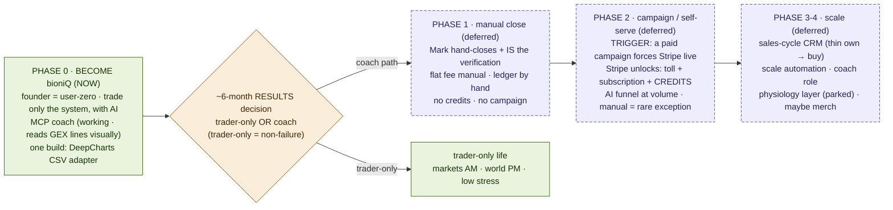

*TAGS: business-plan, build, marketing | AUDIENCE: founder + every future Claude (read this to know WHAT to build WHEN).*
*CREATED: 2026-06-07, Chat 6 | UPDATED: 2026-07-11, Chat 8 (`CHANGED FROM PRIOR`: added PHASE 0 — BECOME bioniQ (NOW) + the ~6-month trader-vs-coach RESULTS gate; Phases 1-4 re-labelled DEFERRED (coach path only); map redrawn to match. Earlier Chat 6: PHASE-2 ECONOMICS — verified cost stack: ~1.5¢/4.5¢/7.5¢ per session, ~6% small-charge skim) | STATUS: living*
*SUPERSEDES: — | RELATED: master_strategy_vision.md (THE primer), build_vs_buy_and_competitive_read.md (sourcing), credit_value_pricing_model.md (the credit sauce), funnel_routing_and_closer.md (the funnel flow), tech_architecture_skeleton.md (components), master_journey_flow.md (the journey + the 3 Forks)*

# GOLD — THE PHASE ROADMAP (the master build/launch sequence)
*Chat 6. Built because the sequence was SCATTERED across docs — so a Claude assumed one thing and would code another. This is the one place that says what's manual vs automated vs gated, per phase.*

## ONE-LINE
The master plan in order. Before building anything, check which phase it belongs to here, so you don't
ship a later-phase thing early or assume an earlier-phase shortcut still applies.

## THE GATE PRINCIPLE — phases advance on TRIGGERS, not dates
- **The big trigger: a paid campaign / open self-serve signups FORCES Stripe live.** You cannot run a
  $9.99-course funnel by hand at 3am. So "launch a campaign" and "Stripe is live" are the **same event**,
  not two separate choices.
- **The ledger is the source of truth for "paid."** Stripe writes it automatically; Mark writes it by
  hand only for the rare exception (a crypto request, a comp, a refund). Once automated, manual
  intervention is the exception, never the normal path. (Ledger = `credit_ledger` in Supabase.)

## PHASE 0 — BECOME bioniQ (NOW) — `CHANGED FROM PRIOR` (Chat 7; see strategy_become_bioniq_first.md)
- **The center of gravity moved here.** Before any business phase runs, **Mark trades only his system,
  with AI, as user-zero.** No platform exists and none is needed for this phase: journal in the existing
  app (or a minimal DeepCharts-adapted version), coach via Claude/**MCP** (working — confirmed Chat 8;
  reads the GEX indicator's plotted lines **visually**, not by data), macro via Cowork.
- **The one near-term build:** the **DeepCharts CSV adapter** (Mark left NinjaTrader — it froze).
- **The gate out of Phase 0:** the **~6-month RESULTS decision** — trader-only OR coach. Trader-only is
  a non-failure (arguably better) outcome. **Phases 1–4 below are the DEFERRED business track — they run
  only if the coach path is chosen.** Deferred-not-abandoned; the goldmine holds them.
- **Track A feeds Track B:** what Mark learns trading-with-AI gets banked as specs — the filters AI finds
  = his A+ criteria = the platform's future coaching rules.

## PHASE 1 — MANUAL CLOSE (deferred — first business phase IF the coach path is chosen)
- **Trigger:** pre-campaign. Mark hand-closes a handful he speaks to directly.
- **Funnel:** Mark IS the funnel and the verification (the 1:1 call) — no paid campaign at volume.
- **Payment:** flat fee, paid manually (PayPal / crypto / e-transfer); Mark marks the ledger "paid."
- **Credits:** none. **Automated $10/$9.99 toll:** none (Mark-on-the-call is the verification).
- **Being built/tested:** the coaching brain + the dossier (the moat).
- **Why:** learn onboarding by living it; zero automation overhead while N is tiny.

## PHASE 2 — CAMPAIGN / SELF-SERVE (the coupled milestone)
- **Trigger:** the first paid campaign or open self-serve signups → **Stripe MUST be live.**
- **Stripe unlocks TOGETHER (one milestone, not separate ships):** the automated **card-toll**
  (verification = real card), **subscription** auto-billing, AND the **credit engine + metered top-ups**
  (the monetization sauce). **Credits CANNOT precede this** — they are metered usage, not a manual charge.
- **Funnel:** the AI-agent funnel + A/B/C sort run at volume (funnel_routing_and_closer.md goes live
  end-to-end); Fork-1 cold reach is rentable here.
- **Payment:** automated; manual = rare exception, still written to the ledger.

## PHASE 3-4 — SCALE (later)
- **Sales-cycle CRM** — thin own pipeline first, buy/integrate only if scale justifies; never a
  Salesforce clone (build_vs_buy_and_competitive_read.md → CRM).
- **Scale automation**, and the **coach role** (phase 3, per coaching_philosophy.md / master_journey_flow.md).
- **Possibly Shopify / merch** — a parked brand play, not a revenue pillar.
- **Parked feature idea — the TRADER-AS-ATHLETE physiology layer** (wearable import: Oura/Apple Watch/Garmin +
  manual physiology journal; coach correlates body data with trade discipline) → **trader_as_athlete_physiology_layer.md**.
  Idea-parked Chat 7; **do NOT build until Phase-1 platform is in beta.** Within the feature: manual physiology
  input is the MVP (validates with zero API), Oura adapter second (for Mark), other devices on demand.

## WHAT GATES ON WHAT (the quick check)
- **Subscription** can straddle — manual flat-fee in Phase 1, auto in Phase 2.
- **Credits** → Phase 2 (gated on Stripe + the credit engine). Never manual, never earlier.
- **Automated toll / verification** → Phase 2 (card rails). In Phase 1 the verification is Mark on the call.
- **Paid campaign** → Phase 2 (forces Stripe live).
- **CRM, merch** → Phase 3-4.
- **Coaching brain + dossier** → built in Phase 1, goes self-serve in Phase 2.

## THE MAP

## PHASE-2 ECONOMICS (the cost stack, verified Chat 6)
When Stripe goes live with credits, the numbers are known (full detail in credit_value_pricing_model.md +
reports/): per coaching session ≈ **1.5¢ Haiku / 4.5¢ Sonnet / 7.5¢ Opus** (Anthropic dominates; Cloudflare
~$0 with cache hits free; cap per-student spend via CF spend-limits). Payments: the $10 toll / $9.99 Journal
carries a **~6% Stripe skim** (fixed 30¢ on small charges) — price the credit/toll above cost and don't
bank on keeping all of a sub-$10 charge.

## INDEX LINE
`knowledge/phase_roadmap.md | business-plan, build, marketing | PUBLIC | living | THE master build/launch sequence (ends the scatter): WHAT to build WHEN. CHANGED FROM PRIOR (Chat 7/8): PHASE 0 = BECOME bioniQ (NOW — founder as user-zero, MCP coach working, one build = DeepCharts CSV adapter) → ~6-month RESULTS gate (trader-only OR coach; trader-only = non-failure) → Phases 1-4 are the DEFERRED business track, coach path only. Phases advance on TRIGGERS not dates — the big one: a paid campaign/self-serve FORCES Stripe live (no $9.99 charges by hand at 3am); ledger = source of truth for paid (Stripe auto, Mark manual for rare exceptions). P1 manual close (Mark IS the funnel+verification, flat fee manual, NO credits/campaign). P2 campaign/self-serve = the coupled milestone: Stripe unlocks toll+subscription+CREDITS together (credits can't precede it); AI funnel at volume. P3-4 scale: CRM (thin own→buy), coach role, maybe Shopify/merch. Gates: subscription can straddle; credits/campaign/toll→P2; CRM/merch→P3-4.`
