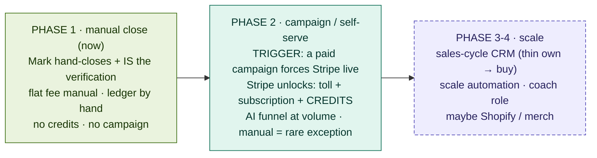

*TAGS: business-plan, build, marketing | AUDIENCE: founder + every future Claude (read this to know WHAT to build WHEN).*
*CREATED: 2026-06-07, Chat 6 | UPDATED: 2026-06-07, Chat 6 | STATUS: living*
*SUPERSEDES: — | RELATED: master_strategy_vision.md (THE primer), build_vs_buy_and_competitive_read.md (sourcing), credit_value_pricing_model.md (the credit sauce), funnel_routing_and_closer.md (the funnel flow), tech_architecture_skeleton.md (components), master_journey_flow.md (the journey + the 3 Forks)*

# GOLD — THE PHASE ROADMAP (the master build/launch sequence)
*Chat 6. Built because the sequence was SCATTERED across docs — so a Claude assumed one thing and would code another. This is the one place that says what's manual vs automated vs gated, per phase.*

## ONE-LINE
The master plan in order. Before building anything, check which phase it belongs to here, so you don't
ship a later-phase thing early or assume an earlier-phase shortcut still applies.

## THE GATE PRINCIPLE — phases advance on TRIGGERS, not dates
- **The big trigger: a paid campaign / open self-serve signups FORCES Stripe live.** You cannot run a
  $9.99-course funnel by hand at 3am. So "launch a campaign" and "Stripe is live" are the **same event**,
  not two separate choices.
- **The ledger is the source of truth for "paid."** Stripe writes it automatically; Mark writes it by
  hand only for the rare exception (a crypto request, a comp, a refund). Once automated, manual
  intervention is the exception, never the normal path. (Ledger = `credit_ledger` in Supabase.)

## PHASE 1 — MANUAL CLOSE (now)
- **Trigger:** pre-campaign. Mark hand-closes a handful he speaks to directly.
- **Funnel:** Mark IS the funnel and the verification (the 1:1 call) — no paid campaign at volume.
- **Payment:** flat fee, paid manually (PayPal / crypto / e-transfer); Mark marks the ledger "paid."
- **Credits:** none. **Automated $10/$9.99 toll:** none (Mark-on-the-call is the verification).
- **Being built/tested:** the coaching brain + the dossier (the moat).
- **Why:** learn onboarding by living it; zero automation overhead while N is tiny.

## PHASE 2 — CAMPAIGN / SELF-SERVE (the coupled milestone)
- **Trigger:** the first paid campaign or open self-serve signups → **Stripe MUST be live.**
- **Stripe unlocks TOGETHER (one milestone, not separate ships):** the automated **card-toll**
  (verification = real card), **subscription** auto-billing, AND the **credit engine + metered top-ups**
  (the monetization sauce). **Credits CANNOT precede this** — they are metered usage, not a manual charge.
- **Funnel:** the AI-agent funnel + A/B/C sort run at volume (funnel_routing_and_closer.md goes live
  end-to-end); Fork-1 cold reach is rentable here.
- **Payment:** automated; manual = rare exception, still written to the ledger.

## PHASE 3-4 — SCALE (later)
- **Sales-cycle CRM** — thin own pipeline first, buy/integrate only if scale justifies; never a
  Salesforce clone (build_vs_buy_and_competitive_read.md → CRM).
- **Scale automation**, and the **coach role** (phase 3, per coaching_philosophy.md / master_journey_flow.md).
- **Possibly Shopify / merch** — a parked brand play, not a revenue pillar.

## WHAT GATES ON WHAT (the quick check)
- **Subscription** can straddle — manual flat-fee in Phase 1, auto in Phase 2.
- **Credits** → Phase 2 (gated on Stripe + the credit engine). Never manual, never earlier.
- **Automated toll / verification** → Phase 2 (card rails). In Phase 1 the verification is Mark on the call.
- **Paid campaign** → Phase 2 (forces Stripe live).
- **CRM, merch** → Phase 3-4.
- **Coaching brain + dossier** → built in Phase 1, goes self-serve in Phase 2.

## THE MAP

## INDEX LINE
`knowledge/phase_roadmap.md | business-plan, build, marketing | PUBLIC | living | THE master build/launch sequence (ends the scatter): WHAT to build WHEN. Phases advance on TRIGGERS not dates — the big one: a paid campaign/self-serve FORCES Stripe live (no $9.99 charges by hand at 3am); ledger = source of truth for paid (Stripe auto, Mark manual for rare exceptions). P1 manual close (Mark IS the funnel+verification, flat fee manual, NO credits/campaign). P2 campaign/self-serve = the coupled milestone: Stripe unlocks toll+subscription+CREDITS together (credits can't precede it); AI funnel at volume. P3-4 scale: CRM (thin own→buy), coach role, maybe Shopify/merch. Gates: subscription can straddle; credits/campaign/toll→P2; CRM/merch→P3-4.`
