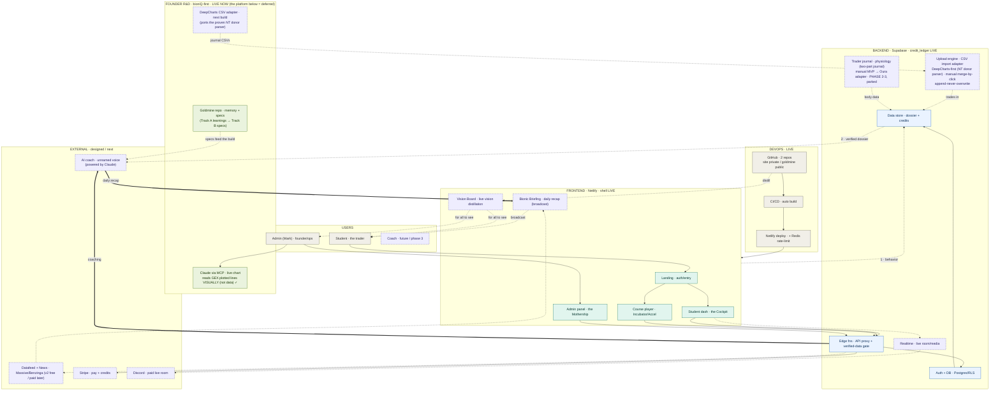
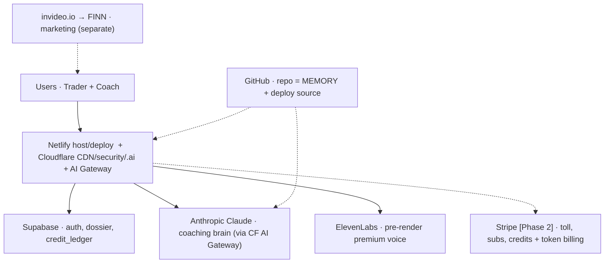

*TAGS: build, business-plan | AUDIENCE: founder + every future Claude (the SYSTEM coordinate system).*
*CREATED: 2026-06-04, Chat 4 | UPDATED: 2026-07-11, Chat 8 (`CHANGED FROM PRIOR` honest-state banner: platform = DEFERRED, current system = FOUNDER R&D (MCP working — reads GEX lines visually, not data; DeepCharts adapter = next build); Mermaid gains Founder-R&D cluster + import adapter (DeepCharts-first, manual merge, append-never-overwrite) + two-part trader journal (P2-3, parked); SVG RE-SYNCED — master re-rendered as the 5-layer flow, prior tool-stack art preserved as tech_tool_stack.svg. Earlier Chat 7: added MODEL TIERING — Opus 4.8 workhorse $5/$25 / Fable 5 metered premium $10/$50 = 2x, verified Chat 7; tier-by-plan + ties to credit engine; meter Fable, don't route-all; ⚠️ Fable = Covered Model, 30-day retention, NO ZDR on API — verified, cross-flagged as a launch gate in security_and_secrets.md. Earlier Chat 6: 7-TOOL STACK roster + Mermaid; SVG re-rendered; TTS pre-render premium/Web Speech fallback) | STATUS: captured (master resolved; SVG re-synced Chat 6)*
*SUPERSEDES: — | RELATED: master_strategy_vision.md (THE primer), master_journey_flow.md (the JOURNEY; this is the SYSTEM), funnel_routing_and_closer.md, voice_tts_decision.md, repo_as_memory_and_handoff.md, brand_funnel_architecture.md, data_provenance_and_timestamp_pin.md*

# GOLD — MASTER TECH ARCHITECTURE (the system coordinate system)

## WHAT THIS IS / ISN'T
The SYSTEM — what the whole thing is *made of* — paired with `master_journey_flow.md`, which is what
the human *experiences*. Refined from the Chat-4 skeleton; the six open questions were resolved with
Mark in Chat 5 (see RESOLVED DECISIONS). The per-layer child flows are still to build. Ships as a
matched pair: this Mermaid source + `tech_architecture_master.svg` (the rendered half), same commit.

## THE HONEST STATE LINE — read this before you trust the boxes
**`CHANGED FROM PRIOR` (Chat 7/8 — strategy_become_bioniq_first.md): the PLATFORM below is DEFERRED,
not the current build.** The system actually running today is **FOUNDER R&D (bioniQ-first)**: the
goldmine (repo-as-memory) + **Claude via MCP on the live chart — working, confirmed Chat 8; it reads the
GEX indicator's plotted lines VISUALLY (screen/render), not as data** + the old journal app + the
**DeepCharts CSV adapter** as the one near-term build. Everything below remains the valid architecture
for the coach path (~6-month results decision) — deferred-not-abandoned.
The skeleton drew all five layers as if co-equal and running. They are not. Most of the system is
designed, not wired. The diagram now encodes that: **solid = live today, dashed = designed / next.**
- **LIVE today:** Netlify (deploy) · GitHub two repos · Supabase (credit_ledger live) · the deployed
  site shell + the **static** lesson charts. Those charts are built **offline** by Python that reads a
  *verified bar export* and bakes the data into the HTML — there is **no runtime call** to the brain,
  a datafeed, Supabase, or TTS inside them yet.
- **DESIGNED / next:** the ad hook + AI funnel agent, the coaching brain *in-product*, the
  funnel-memory pipeline (Fork 2), a live/replayable datafeed, premium TTS.
- **CAVEAT (look-don't-assume):** this live/designed split is inferred from the **public** goldmine
  repo + Mark's handoff notes. The live website is the **private** `bionicbutterfly` repo (Netlify),
  which a Claude **cannot** see. Anything already wired there is invisible here — confirm with Mark.

## THE FIVE LAYERS (matches the rendered SVG)
- **Users** (gray): Student (the trader) · Admin = Mark (founder/ops) · Coach (future, phase 3 — dashed).
- **Frontend · Netlify** (teal, shell LIVE): Landing (auth/entry) · Student dash (the **Cockpit**) ·
  Course player (Incubator/Accelerator) · Admin panel (the **Mothership**). **Pre-rendered premium voice**
  is the default for fixed content (served as audio); Web Speech runs client-side as fallback only.
- **Backend · Supabase** (blue, credit_ledger LIVE): Auth + DB (Postgres/RLS) · Data store
  (**candidate_dossier + credits**) · **Edge functions = API proxy + the verified-data gate** ·
  Realtime (live room/media — designed).
- **External services** (purple, designed/next): **AI coach** = the unnamed voice, **powered by Claude**
  (Anthropic) · Datafeed = **Massive.com** (v2 free → paid later) · Stripe (pay + credits) · Discord
  (paid live room). Premium neural TTS (e.g. a Mark-owned cloned voice) is the **default** brand voice; pick the managed/self-host provider at build (see voice_tts_decision.md).
- **DevOps** (gray, LIVE): GitHub (2 repos: site `bionicbutterfly` private + `bionicbutterfly-goldmine`
  public) · CI/CD (auto build) · Netlify deploy (+ Redis rate-limit).
- **Acquisition / the funnel is CROSS-CUTTING, not its own layer:** the hook + AI funnel agent
  (drip · qualify · the 3-way sort) is implemented across Frontend (Landing), Backend (Edge fns), and
  External (the Claude-powered agent). The journey view owns it — see `master_journey_flow.md` +
  `funnel_routing_and_closer.md`.

## FLOW (Mermaid source — paired with tech_architecture_master.svg)
> ✅ **SVG RE-SYNCED (Chat 8):** `tech_architecture_master.svg` was re-rendered as the 5-layer flow to
> match the Mermaid below (incl. Bionic Briefing, Vision Board, Founder R&D, import adapter, trader
> journal). The prior SVG was actually a render of the **7-tool stack** Mermaid further down — that art
> is preserved as its own pair: `tech_tool_stack.svg`. Pairing-rule claim holds again for both.

## RESOLVED DECISIONS (Chat 5, with Mark)
1. **Fork 2 — funnel memory = BUILD (not buy).** The "we already know you" loop:
   foyer emits behavior events -> Supabase **`candidate_dossier`** (one row per candidate) ->
   the Anthropic brain reads the **verified** dossier at coaching time -> coaching returns to the
   platform. This also resolves Q2/Q4: **the student profile / calling-card lives in Supabase**,
   written by the funnel, condensed into the dossier for the brain. (Whiting's TEDI does not build this.)
2. **Datafeed = phased.**
   - **v1 (now, days/weeks):** manual NinjaTrader exports, close-stamp + UTC pinned (see
     `data_provenance_and_timestamp_pin.md`), promoted only through the human-in-the-loop gate.
   - **v2 (pre-student dev):** **Massive.com free tier** — formerly **Polygon.io**; official GitHub
     org (`massive-com`) + a Claude MCP server; **5 API calls/min** on free; **delayed** data on free
     (Mark's note ~10 min; vendor lists Starter $29/mo = 15-min delayed — confirm exact free delay on
     the pricing page); covers **CME futures incl. micros (MNQ-relevant)**.
   - **student-scale / real-time (later):** Massive paid (Developer $79/mo real-time, Advanced
     $199/mo unlimited + WebSocket) — confirm pricing at purchase.
3. **Data gate = HUMAN-IN-THE-LOOP**, per Mark's definition: Claude **audits -> confirms with Mark ->
   fixes any issue -> confirms pass (or "not a blocker now") -> gets Mark's GO** before proceeding.
   This is a **standing checkpoint discipline**, not only a /data rule — it exists so a Claude never
   runs far down a path that turns out wrong. *(Proposed for the maintenance law — see housekeeping.)*
4. **TTS = pre-render premium voice default; Web Speech = fallback.** `CHANGED FROM PRIOR` (Chat 6,
   matching the Chat-5 flip in `voice_tts_decision.md`): Chat 4 had "free Web Speech default, premium
   later." Now reversed — fixed authored content is pre-rendered once with a premium neural voice
   ($0/student after the render + exact timestamps for super-sauce sync); Web Speech is the offline
   fallback. Premium voice is no longer a "later" nice-to-have; it's the default brand voice (voice
   itself is an opt-in credit layer, text is the floor).
5. **Anthropic per-student cost = the core margin risk** (same lesson as TTS): only **verified** data
   reaches the brain; cache/precompute; don't call the brain per keystroke. The dollar tolerance is
   Mark's business call, not Claude's to set. **Two-tier wallet:** Mark holds the master supplier wallet;
   the `credit_ledger` meters supplier COGS vs each student's credit balance/usage (two-sided, not one
   counter). **Prompt caching + the dossier** cut re-read cost so a student turn doesn't re-pay to
   reprocess full history. The Lab must surface a **live credit meter** (remaining / used-this-session /
   last-interaction cost) — transparency is the precondition for the value-pricing psychology, and
   graceful credit-exhaustion (warn early, smooth top-up, never freeze/lose work) is a hard requirement
   (see credit_value_pricing_model.md).
6. **Each layer -> its own child flow** (matched pair) — next task. See below.

## THE VERIFIED-ONLY RULE (wired into the architecture)
Only `/data/verified` reaches the datafeed-promotion step, the dossier, and the brain. `/data/unverified`
never does. This mirrors README §5 and the gate checklist — the data discipline IS part of the system.

## CHILD FLOWS TO BUILD (each = a box above, its own matched diagram + Mermaid pair)
- **Acquisition:** ad hook -> AI funnel agent (the ambient drip/qualify "interview").
- **Funnel-memory pipeline (Fork 2) — the priority build spec:** behavior event schema -> write to
  `candidate_dossier` (Supabase) -> brain read contract. What signals, what shape, what the brain sees.
- **Platform internals:** foyer · Lab · journal · the pre-rendered premium voice (Web Speech fallback) + the onboundary/timestamp narration-sync.
- **Infrastructure:** the two-repo split (site private / goldmine public), Netlify deploy path,
  Supabase schema (credit_ledger + candidate_dossier).
- **Datafeed:** v1 manual export -> gate -> verified; v2 Massive.com pull (rate-limit-aware at 5/min)
  -> gate -> verified.
- **Brain:** prompt/runtime, the verified-data gate, and the per-student cost controls.

## STILL OPEN (needs Mark; none block the master)
- Exact Massive **free-tier delay** (10 vs 15 min) and whether v2 pulls MNQ directly or via a proxy symbol.
- Per-student **$ tolerance** for the brain (sets the caching aggressiveness).
- (Carried, not architecture) the `two_strategy_split.md` scope question — but it feeds the brain's grader.

## THE 7-TOOL STACK + MARKETING (Chat 6 — full roster, SVG re-rendered to match)
Current four (Netlify, Supabase, Anthropic, GitHub) + ElevenLabs, Cloudflare, Stripe; invideo.io/FINN is
marketing, separate from the platform.
- **GitHub** — repo = MEMORY + deploy source (feeds Netlify deploy + Claude's context).
- **Netlify** — host + deploy (swappable later; Cloudflare Pages could absorb it — Mark's call).
- **Cloudflare** — edge: CDN, security, the `.ai` registrar, AND the **AI Gateway** in front of Claude
  (route + cache + meter). Cache hits cut the Anthropic bill; dollar spend-limits cap per-student runaway.
- **Supabase** — auth · candidate_dossier · credit_ledger (the owned data / moat).
- **Anthropic (Claude)** — the coaching brain, called *through* the CF AI Gateway.
- **ElevenLabs** — pre-render premium voice (the locked default; Web Speech = fallback).
- **Stripe [Phase 2]** — toll · subscription · credits; LLM-token metered billing (markup) can read token
  usage from the CF gateway — but token-billing is private-preview/gated (DIY Meter-Events or a partner if
  the waitlist hasn't opened).
- **invideo.io → FINN** — marketing video / top-of-funnel content (separate from the platform).
*Stripe vs Cloudflare clarified: not "Stripe does tokens via Cloudflare." Cloudflare AI Gateway meters +
caches the AI traffic; Stripe bills it with your margin. Complementary, both Phase-2. Costs in
credit_value_pricing_model.md + reports/.*

## MODEL TIERING — Opus 4.8 workhorse / Fable 5 metered premium (Chat 7)
Anthropic segments the lineup; we **tier the intelligence** rather than route everything to the frontier
— same build-vs-buy doctrine: **match the expensive resource to the high-value moment.** This governs
which model the **Anthropic brain** (above) calls, per task and per plan.

- **Claude Opus 4.8 = the production workhorse.** ~**$5 / $25** per MTok (in/out) — *verified Chat 7
  against Anthropic docs.* Default for: daily journal reviews, chart-narrative summaries, lesson
  generation, risk coaching, onboarding, most build/coding, high-volume coaching.
- **Claude Fable 5 = the metered premium brain.** ~**$10 / $50** per MTok — **exactly 2× Opus** (*verified
  Chat 7*). Reserve for: premium "deep review" sessions, multi-week behavioural pattern analysis, advanced
  strategy critique — the hard cases where the user pays more.
- **Product packaging — tier the model by plan:** Starter (Sonnet/Opus mix) · Pro (Opus default) · Elite
  (Opus + *limited* Fable deep reviews) · Institutional (Fable + strict data controls — see the security
  gate below). **Ties to the credit engine (area 6):** a session's credit price can reflect *which model
  graded it* — Fable deep-reviews cost more credits because they cost more to run.
- **Do NOT route every chat to Fable** — that doubles model cost immediately. **Meter it.** (Structural
  enforcement, not just a rule: the CF AI Gateway route + the credit engine should *default* every call to
  Opus and require an explicit premium-tier flag to reach Fable, so "everything goes to Fable" can't happen
  by omission.)

⚠️ **DATA-RETENTION CONSTRAINT — Fable 5 is a Covered Model (see `security_and_secrets.md` launch gate).**
**VERIFIED Chat 7** against official Anthropic docs (Mark flagged this as *reported*; the PHD ran the
verification he named as the action item — it came back **CONFIRMED**): Fable 5 / Mythos 5 are **Covered
Models requiring 30-day data retention**; **Zero Data Retention is NOT available** for them on the Claude
API (a ZDR-configured org gets a `400 invalid_request_error`). Data is **not** used for training and is
**deleted after 30 days** (except safety-investigation / legal hold). On Bedrock/Vertex/Foundry, retention
is set per platform (Bedrock requires opting into provider data sharing). Opus 4.8 **remains ZDR-eligible.**
→ This is a real tension with our own security doctrine: it would put the **most sensitive deep-dossier
reviews on the model with the least favourable retention terms.** The **verification is now closed**; the
**DECISION is open and Mark's** — recorded as a launch gate in `security_and_secrets.md`. Until Mark
decides, **Fable is NOT cleared for sensitive customer data** (PII / full dossiers); Opus handles anything
ZDR-sensitive.
*Sources (official): platform.claude.com → Manage Claude → API and data retention; support.claude.com →
"Data retention practices for Mythos-class models" (art. 15425996).*

## INDEX LINE
`knowledge/tech_architecture_skeleton.md | build, business-plan | PUBLIC | pending | MASTER system architecture — CHANGED FROM PRIOR (Chat 7/8): the platform is DEFERRED; current LIVE system = FOUNDER R&D (Claude via MCP — reads GEX lines VISUALLY not data, confirmed Chat 8; goldmine; DeepCharts CSV adapter = next build). Mermaid now carries Founder-R&D + import adapter + two-part trader journal (P2-3); SVG re-synced Chat 8 (5-layer master; tool-stack art → tech_tool_stack.svg). (5 layers: Users/Frontend/Backend/External/DevOps; live-vs-designed honest split; Mermaid re-synced to the SVG). Chat-5 resolved: Fork-2 funnel-memory=BUILD (foyer->Supabase candidate_dossier->brain), datafeed v1 manual / v2 Massive.com free (ex-Polygon, 5/min, delayed, CME futures), human-in-the-loop gate, pre-render premium voice = default / Web Speech = fallback (CHANGED FROM PRIOR Chat 6). MODEL TIERING (Chat 7): Opus 4.8 workhorse ($5/$25) / Fable 5 metered premium ($10/$50 = 2x, verified) — tier by plan, tie to credit engine, meter Fable; Fable = Covered Model w/ 30-day retention + NO ZDR on API (verified Chat 7 → launch gate in security_and_secrets.md). Paired with tech_architecture_master.svg. Child flows next.`
