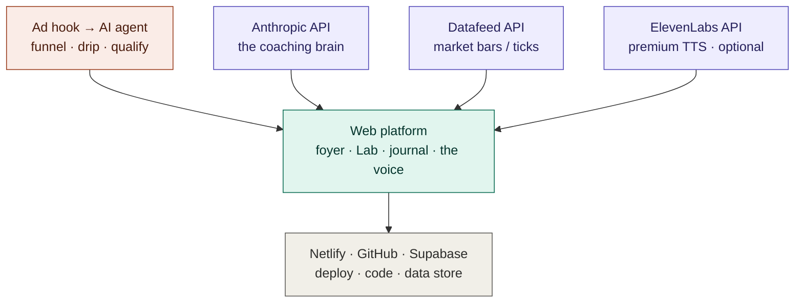

# GOLD — TECH ARCHITECTURE (SKELETON / DRAFT)
*TAGS: build, business-plan | AUDIENCE: founder + the next (fresh) Claude.*
*CREATED: 2026-06-06, Chat 4 | UPDATED: 2026-06-06, Chat 4 | STATUS: draft*
*SUPERSEDES: — | RELATED: master_journey_flow.md (the JOURNEY; this is the SYSTEM)*

## WHAT THIS IS / ISN'T
First-cut skeleton of how the whole system is wired, captured while the components were fresh in
Mark's head at the end of Chat 4. **STATUS: draft on purpose** — the polished architecture is the next
fresh Claude's spacious first task. Refine, don't inherit-as-final. Distinct from the master JOURNEY
flow (what the human experiences); this is what the SYSTEM is made of.

## THE FOUR LAYERS
- **Acquisition** (coral): ad hook → AI agent → funnel · drip · qualify.
- **Platform / the product** (teal): web platform — foyer · Lab · journal · the no-name voice.
- **Infrastructure** (gray): Netlify (deploy) · GitHub (code; NOTE two repos — site `bionicbutterfly`
  private + memory `bionicbutterfly-goldmine` public) · Supabase (data store).
- **External services** (purple): Anthropic API (the coaching brain) · market Datafeed API (bars/ticks)
  · ElevenLabs API (premium TTS, optional — free Web Speech is the default per voice_tts_decision).

## FLOW (Mermaid source — paired with the rendered skeleton diagram)

## OPEN QUESTIONS (the fresh Claude resolves these to finish the architecture)
1. **The funnel-memory pipeline (Fork 2):** how does foyer behavior reach the platform + the brain?
   This is the "we already know you" promise — likely a build, not a buy.
2. **Where does the student profile / calling-card live** — Supabase? Who writes it (funnel? platform?).
3. **Anthropic API:** per-student cost model + the data gate (only VERIFIED data reaches the brain).
4. **Datafeed:** which provider, what granularity, how it feeds the engine + charts.
5. **TTS:** free Web Speech default vs ElevenLabs premium tier.
6. **Each layer box → its own child flow** (matched diagram + Mermaid pair).
