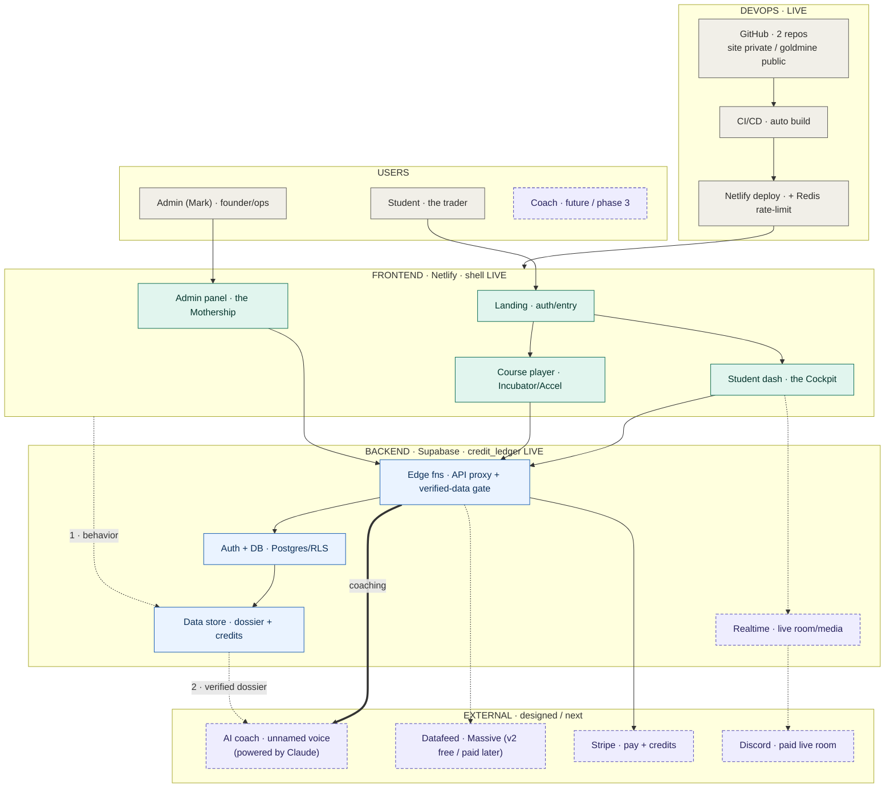

*TAGS: build, business-plan | AUDIENCE: founder + every future Claude (the SYSTEM coordinate system).*
*CREATED: 2026-06-06, Chat 4 | UPDATED: 2026-06-06, Chat 5 (Mermaid re-synced to the 5-layer SVG; the pair now matches) | STATUS: captured (master resolved & confirmed Chat 5; child flows open as separate artifacts)*
*SUPERSEDES: — | RELATED: master_strategy_vision.md (THE primer), master_journey_flow.md (the JOURNEY; this is the SYSTEM), funnel_routing_and_closer.md, voice_tts_decision.md, repo_as_memory_and_handoff.md, brand_funnel_architecture.md, data_provenance_and_timestamp_pin.md*

# GOLD — MASTER TECH ARCHITECTURE (the system coordinate system)

## WHAT THIS IS / ISN'T
The SYSTEM — what the whole thing is *made of* — paired with `master_journey_flow.md`, which is what
the human *experiences*. Refined from the Chat-4 skeleton; the six open questions were resolved with
Mark in Chat 5 (see RESOLVED DECISIONS). The per-layer child flows are still to build. Ships as a
matched pair: this Mermaid source + `tech_architecture_master.svg` (the rendered half), same commit.

## THE HONEST STATE LINE — read this before you trust the boxes
The skeleton drew all five layers as if co-equal and running. They are not. Most of the system is
designed, not wired. The diagram now encodes that: **solid = live today, dashed = designed / next.**
- **LIVE today:** Netlify (deploy) · GitHub two repos · Supabase (credit_ledger live) · the deployed
  site shell + the **static** lesson charts. Those charts are built **offline** by Python that reads a
  *verified bar export* and bakes the data into the HTML — there is **no runtime call** to the brain,
  a datafeed, Supabase, or TTS inside them yet.
- **DESIGNED / next:** the ad hook + AI funnel agent, the coaching brain *in-product*, the
  funnel-memory pipeline (Fork 2), a live/replayable datafeed, premium TTS.
- **CAVEAT (look-don't-assume):** this live/designed split is inferred from the **public** goldmine
  repo + Mark's handoff notes. The live website is the **private** `bionicbutterfly` repo (Netlify),
  which a Claude **cannot** see. Anything already wired there is invisible here — confirm with Mark.

## THE FIVE LAYERS (matches the rendered SVG)
- **Users** (gray): Student (the trader) · Admin = Mark (founder/ops) · Coach (future, phase 3 — dashed).
- **Frontend · Netlify** (teal, shell LIVE): Landing (auth/entry) · Student dash (the **Cockpit**) ·
  Course player (Incubator/Accelerator) · Admin panel (the **Mothership**). Free **Web Speech TTS** runs
  client-side here.
- **Backend · Supabase** (blue, credit_ledger LIVE): Auth + DB (Postgres/RLS) · Data store
  (**candidate_dossier + credits**) · **Edge functions = API proxy + the verified-data gate** ·
  Realtime (live room/media — designed).
- **External services** (purple, designed/next): **AI coach** = the unnamed voice, **powered by Claude**
  (Anthropic) · Datafeed = **Massive.com** (v2 free → paid later) · Stripe (pay + credits) · Discord
  (paid live room). ElevenLabs premium TTS is optional/later.
- **DevOps** (gray, LIVE): GitHub (2 repos: site `bionicbutterfly` private + `bionicbutterfly-goldmine`
  public) · CI/CD (auto build) · Netlify deploy (+ Redis rate-limit).
- **Acquisition / the funnel is CROSS-CUTTING, not its own layer:** the hook + AI funnel agent
  (drip · qualify · the 3-way sort) is implemented across Frontend (Landing), Backend (Edge fns), and
  External (the Claude-powered agent). The journey view owns it — see `master_journey_flow.md` +
  `funnel_routing_and_closer.md`.

## FLOW (Mermaid source — paired with tech_architecture_master.svg)

## RESOLVED DECISIONS (Chat 5, with Mark)
1. **Fork 2 — funnel memory = BUILD (not buy).** The "we already know you" loop:
   foyer emits behavior events -> Supabase **`candidate_dossier`** (one row per candidate) ->
   the Anthropic brain reads the **verified** dossier at coaching time -> coaching returns to the
   platform. This also resolves Q2/Q4: **the student profile / calling-card lives in Supabase**,
   written by the funnel, condensed into the dossier for the brain. (Whiting's TEDI does not build this.)
2. **Datafeed = phased.**
   - **v1 (now, days/weeks):** manual NinjaTrader exports, close-stamp + UTC pinned (see
     `data_provenance_and_timestamp_pin.md`), promoted only through the human-in-the-loop gate.
   - **v2 (pre-student dev):** **Massive.com free tier** — formerly **Polygon.io**; official GitHub
     org (`massive-com`) + a Claude MCP server; **5 API calls/min** on free; **delayed** data on free
     (Mark's note ~10 min; vendor lists Starter $29/mo = 15-min delayed — confirm exact free delay on
     the pricing page); covers **CME futures incl. micros (MNQ-relevant)**.
   - **student-scale / real-time (later):** Massive paid (Developer $79/mo real-time, Advanced
     $199/mo unlimited + WebSocket) — confirm pricing at purchase.
3. **Data gate = HUMAN-IN-THE-LOOP**, per Mark's definition: Claude **audits -> confirms with Mark ->
   fixes any issue -> confirms pass (or "not a blocker now") -> gets Mark's GO** before proceeding.
   This is a **standing checkpoint discipline**, not only a /data rule — it exists so a Claude never
   runs far down a path that turns out wrong. *(Proposed for the maintenance law — see housekeeping.)*
4. **TTS = free Web Speech default** (client-side, $0/student); ElevenLabs premium **later**, never a
   launch dependency (per `voice_tts_decision.md`).
5. **Anthropic per-student cost = the core margin risk** (same lesson as TTS): only **verified** data
   reaches the brain; cache/precompute; don't call the brain per keystroke. The dollar tolerance is
   Mark's business call, not Claude's to set. **Two-tier wallet:** Mark holds the master supplier wallet;
   the `credit_ledger` meters supplier COGS vs each student's credit balance/usage (two-sided, not one
   counter). **Prompt caching + the dossier** cut re-read cost so a student turn doesn't re-pay to
   reprocess full history. The Lab must surface a **live credit meter** (remaining / used-this-session /
   last-interaction cost) — transparency is the precondition for the value-pricing psychology, and
   graceful credit-exhaustion (warn early, smooth top-up, never freeze/lose work) is a hard requirement
   (see credit_value_pricing_model.md).
6. **Each layer -> its own child flow** (matched pair) — next task. See below.

## THE VERIFIED-ONLY RULE (wired into the architecture)
Only `/data/verified` reaches the datafeed-promotion step, the dossier, and the brain. `/data/unverified`
never does. This mirrors README §5 and the gate checklist — the data discipline IS part of the system.

## CHILD FLOWS TO BUILD (each = a box above, its own matched diagram + Mermaid pair)
- **Acquisition:** ad hook -> AI funnel agent (the ambient drip/qualify "interview").
- **Funnel-memory pipeline (Fork 2) — the priority build spec:** behavior event schema -> write to
  `candidate_dossier` (Supabase) -> brain read contract. What signals, what shape, what the brain sees.
- **Platform internals:** foyer · Lab · journal · the Web Speech voice + the onboundary narration-sync.
- **Infrastructure:** the two-repo split (site private / goldmine public), Netlify deploy path,
  Supabase schema (credit_ledger + candidate_dossier).
- **Datafeed:** v1 manual export -> gate -> verified; v2 Massive.com pull (rate-limit-aware at 5/min)
  -> gate -> verified.
- **Brain:** prompt/runtime, the verified-data gate, and the per-student cost controls.

## STILL OPEN (needs Mark; none block the master)
- Exact Massive **free-tier delay** (10 vs 15 min) and whether v2 pulls MNQ directly or via a proxy symbol.
- Per-student **$ tolerance** for the brain (sets the caching aggressiveness).
- (Carried, not architecture) the `two_strategy_split.md` scope question — but it feeds the brain's grader.

## INDEX LINE
`knowledge/tech_architecture_skeleton.md | build, business-plan | PUBLIC | pending | MASTER system architecture (5 layers: Users/Frontend/Backend/External/DevOps; live-vs-designed honest split; Mermaid re-synced to the SVG). Chat-5 resolved: Fork-2 funnel-memory=BUILD (foyer->Supabase candidate_dossier->brain), datafeed v1 manual / v2 Massive.com free (ex-Polygon, 5/min, delayed, CME futures), human-in-the-loop gate, Web Speech default. Paired with tech_architecture_master.svg. Child flows next.`
